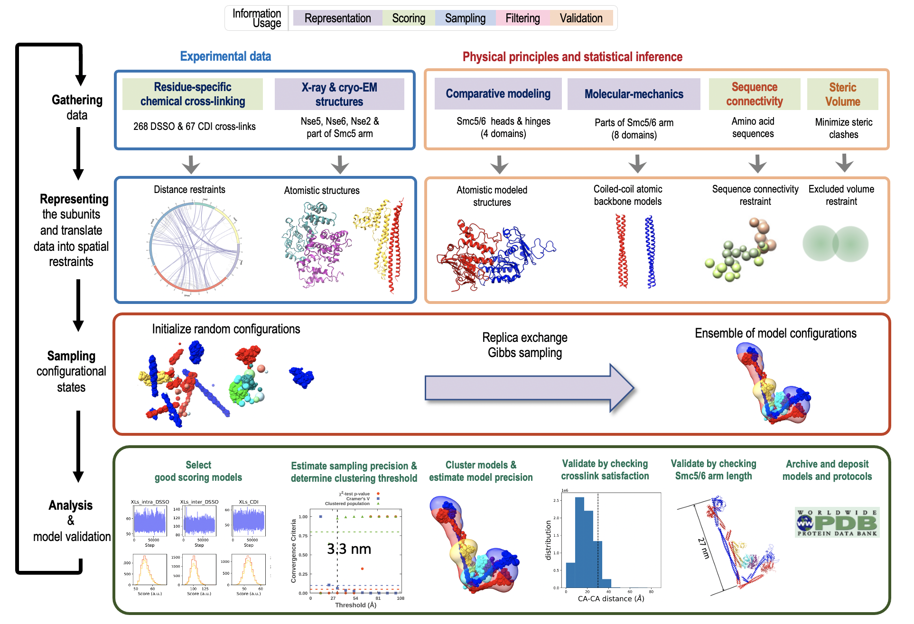

# Integrative structure of the Smc5/6-Nse2/5/6 complex

 

This repository contains Python scripts and associated input data and output results for constructing the integrative model of the  ATP-bound five-subunit yeast Smc5/6-Nse2/5/6 complex, using [IMP](https://integrativemodeling.org), (```develop-255ae6c```), [PMI](https://github.com/salilab/pmi) and [MODELLER](https://salilab.org/modeller).

The input data used for this work is:

* Crystal structure of the a part of the coiled-coil arm of Smc5 in complex with Nse2 (PDB ID: [3htk](https://www.rcsb.org/structure/3HTK)).
* Comparative models of head and hinge regions of Smc5 and Smc6.
* Molecular-mechanics based (energy-minimized) coiled-coil models of Smc5 and Smc6 arm regions.
* Cryo-EM derived structure of Nse5/6 subcomplex (at 3 angstroms resolution) 
* 268 unique DSSO and 67 unique CDI crosslinks. 

First, comparative models of the different parts of Smc5/6 as mentioned above, are constructed using both MODELLER and the [SWISS-MODEL webserver](https://swissmodel.expasy.org/). Next, parametric models of the coiled-coil regions of Smc5/6 arms are designed using the protein design software package [ISAMBARD](https://doi.org/10.1093/bioinformatics/btx352). Finally, models of these different components are put together and the crosslink information is used to create spatial restraints and derive the overall model of the five subunit complex using IMP. The modeling protocol will work with a default build of IMP, but for most effective sampling, IMP should be built with [MPI](https://integrativemodeling.org/2.7.0/doc/ref/namespaceIMP_1_1mpi.html) so that replica exchange can be used.

## List of files and directories:

- ```smc56_domain_definitions.txt``` contains the break-down of different domains of Smc5/6 used to designate / design rigid bodies for integrative modeling.

- `data` contains all input data used in integrative modeling. 

  - Crosslink data in the folder ```data/xl```

  - Pdb files (comparative models, coiled-coil models, crystal structures) in ```data/pdb```

  - Sequences in ```smc56_nse256.fasta.txt```

  - System topology description for PMI to process in ```topology.txt```. 

    

- ```non_cc_comparative_modeling``` contains all comparative models for non-coiled-coil regions of Smc5/6, i.e. the head and hinge regions.

  - Hinge region models generated using SWISS-MODEL are kept in folders of the corresponding name and suffixed SWISSMODEL.

  - Comparative models of the combined Smc5/6 head region is generated using MODELLER and kept in ```non_cc_comparative_modeling/smc56_head_MODELLER```. 

  - The final set of comparative models are kept in ```non_cc_comparative_modeling/best_models```. 

  - ```.png``` files of comparative model structures rendered using [UCSF Chimerax](https://www.cgl.ucsf.edu/chimerax/) are kept in ```non_cc_comparative_modeling/images```. 

  - Different steps of the comparative modeling protocol for hinge and head regions are detailed in the jupyter notebook ```non_cc_comparative_modeling/modeling.ipynb```.

    

- ```cc_parametric_modeling``` contains scripts and results for coiled-coil models designed using [ISAMBARD](https://github.com/isambard-uob/isambard).

  - Coiled coils designed for Smc5/6 are kept in directories ```cc_parametric_modeling/smc5``` and ```cc_parametric_modeling/smc6``` respectively. Each directory contains separate folders for coiled-coils from the head-adjacent (```cc-head```), hinge-adjacent(```cc-hinge```) and middle (```cc-mid-1``` and ```cc-mid-2```) parts of the Smc5/6 arm. 
  - The final set of coiled coil models are kept in ```cc_parametric_modeling/best_models```. 
  - .png files of coiled coil models are kept in ```cc_parametric_modeling/images```. 
  - Python script and utility files for searching coiled-coil design parameters are also kept in this directory.
  - Different steps of the coiled coil design protocol are detailed in the jupyter notebook ```cc_parametric_modeling/modeling.ipynb```.

  

- ```integrative_modeling``` contains (Python and Bash) scripts and results for building integrative models of the complex and performing structural calculations on these models. 

  - ```structural_clustering``` contains results produced by the model validation pipeline (good scoring model rmf files, model precision, localilzation densities).

  - ```structural_calculations``` contains crosslink satisfaction results, and the Smc5/6 arm length and elbow angle.

    

- ```rendering_scripts``` contains python scripts to render convert RMF files to PDB files and for producing the 2D crosslinked schematic in Fig. 2 of the manuscript.

## Worfklow

### Comparative modeling

First, non-comparative models are generated following the steps outlined in the jupyter notebook ```non_cc_comparative_modeling/modeling.ipynb```. The model of Smc5/6 head regions is generated by running the MODELLER script ```non_cc_comparative_modeling/smc56_head_MODELLER/modeling.py``` as:

```markdown
cd non_cc_comparative_modeling/smc56_head_MODELLER
python modeling.py
```

This will produce all output files and a log file (```log.txt```) in this directory. To keep things clean, all of this output has been stored in a separate subfolder ```non_cc_comparative_modeling/smc56_head_MODELLER/output```. The final models produced from this step are all stored in ```non_cc_comparative_modeling/best_models``` and should be copied over to ```data/pdb``` to be used later in integrative modeling.

<br>

### Coiled-coil modeling

Next, coiled-coil models are designed by searching in a parameter space spanned by geometrical descriptors of coiled-coil structures using the ISAMBARD software package. The motivation and all necessary steps are outlined in the notebook ```cc_parameteric_modeling/modeling.ipynb``` and demonstrated in detail for a specific example of the Smc5 coiled coil region adjacent to the head region. The protocol is similar for other coiled coil segments.  The final models produced from this step are all stored in ```cc_parametric_modeling/best_models``` and should be copied over to ```data/pdb``` to be used later in integrative modeling.

<br>

### Integrative modeling

At this stage, PDB files corresponding to different rigid bodies in the complex must be ready and kept in ```data/pdb```. The rigid body definitions can be found in the  PMI topology file ```data/topology.txt```. All python scripts in this folder can be run with a ```-h``` flag, i.e. ```python <script name> -h``` to see its usage, inputs, expected outputs, etc.

- First use ```integrative_modeling/modeling.py``` to build the complex representation, add the spatial restraints and performs conformational sampling. It has a test mode (use flag ```-t```) to run a very short number of Monte Carlo iterations and verify that everything works. Keep results of independent runs using this script in directories called ```run_1, run_2```, etc. Do at least 50 independent runs (you may need a computing cluster resource) for realistic results. Sample usage (that produces output in a directory called ```run_1```): 

  ```markdown
  cd integrative_modeling
  mkdir run_1
  cd run_1
  python ../modeling.py -d ../../data
  ```

- Next, use ```integrative_modeling/analyse_score_distribution.py``` to select equilibrated models and filter them according to their scores (i.e. restraint satisfaction). This calculates restraint satisfactions for all independent runs and also clusters the models based on their scores. Keep all output generated in a directory called ```analys```. Sample usage:

  ```markdown
  cd integrative_modeling
  python analyse_score_distributions.py -i . -o analys -np 20
  ```

- Next, For structural clustering of models, extract a random subsample of good scoring models from the output produced by the score analysis pipeline in the previous step. To do that, run ```integrative_modeling/get_good_scoring_models.py``` as:

  ```markdown
  cd integrative_modeling
  python get_good_scoring_models -a analys -t . -o structural_clustering -np 20
  ```

  This produces all the good scoring models, but partitions them into two sets called ```sample_A_models.rmf3``` and ```sample_B_models.rmf3```, kept in the ```structural_clustering``` directory. The two sub-samples are necessary for running statistical validation tests later, but you can go ahead and concatenate them to produce a single file containing (~30,000) good scoring models. Call this ```good_scoring_models.rmf3```.

  ```
  cd integrative_modeling/structural_clustering
  rmf_cat sample_A_models.rmf3 sample_B_models.rmf3 good_scoring_models.rmf3
  ```

  where, [```rmf_cat```](https://integrativemodeling.org/rmf/nightly/doc/executables.html#rmf_cat) is an executable utility for combining frames from different RMF files and ships with IMP.  This produces the file ```integrative_modeling/structural_clustering/good_scoring_models.rmf3```. 

- Next,  run the executable ```model_precision_job.sh``` to go through a [statistical structural precision analysis pipeline](https://doi.org/10.1016/j.bpj.2017.10.005) to calculate sampling precision, model precision and cluster the good scoring models kept in ```good_scoring_models.rmf3``` according to RMSD. It turns out that using default settings, the clustering is too stringent, i.e. > 100 clusters are produced. To make the clustering smoother, edit the shell script by removing the comment before ```# -s -ct 50``` and rerun clustering. So, the first run is to extract the sampling precision only. Make different directories for these two cases. Recommended directory names are ```sp_auto``` for calculating sampling precision (with automatic / default settings) and then ```sp_50``` to cluster at 50 Å threshold. For calculating only sampling precision:

  ```markdown
  cd integrative_modeling/structural_clustering
  mkdir sp_auto
  cd sp_auto
  cp ../../model_precision_job.sh ./
  cp ../../density_ranges.txt ./
  ./model_precision_job.sh
  ```

  **Only when this run has finished**, rerun at 50 Å threshold.

  ```
  cd integrative_modeling/structural_clustering
  mkdir sp_50
  cd sp_50
  cp ../sp_auto/model_precision_job.sh ./
  ```

  Make the necessary tweak to this version of ```model_precision_job.sh```. Then:

  ```markdown
  cp ../sp_auto/Distance_matrix.npy ./
  cp ../sp_auto/density_ranges.txt ./
  ./model_precision_job.sh
  ```

  Note that in each case, the file ```density_ranges.txt``` needs to be present in the directory from where the shell script is run. This file contains subunit definitions for which 3D localization densities are calculated. For the re-run, a pairwise distance matrix of alignment RMSD among all models ```Distance_matrix.npy``` is also required; just copy it from ```sp_auto```.  This produces the cluster centroids and localization densities in directories called ```sp_50/cluster.0```, ```sp_50/cluster.1``` and so on, and model precision and other statistics for each cluster in ```sp_50```. <br>

  Note that in this repository, only selected results from ```structural_clustering``` and ```analys``` have been retained.

  <br>

### Structural calculations on the integrative models

The *integrative model* is represented not only by the centroid, but the ensemble of all good scoring models in the most populated cluster. To extract structural metrics like Smc5/6 arm length, etc, the calculation should be repeated for all models in the top-cluster so as to produce a mean and an error-bar for that metric. All of these results are kept in ```integrative_modeling/structural_calculations```.  To calculate crosslink satisfaction (and store the results in a folder called ```structural_calculations/xl_satisfaction```):

```markdown
cd integrative_modeling/structural_calculations
python ../get_XL_satisfaction.py -r ../structural_clustering/good_scoring_models.rmf3 -c 0 -m ../structural_clustering/sp_50/cluster.0.all.txt -xl ../../data/xl/xl_all.csv -o ./xl_satisfaction/
```

To calculate Smc5/6 arm geometry related metrics (and store it in a file called ```structural_calculations/Smc56_arm_geometry.txt```):

```markdown
cd integrative_modeling/structural_calculations
python ../get_Smc56_arm_geometry.py -r ../structural_clustering/good_scoring_models.rmf3 -c 0 -m ../structural_clustering/sp_50/cluster.0.all.txt -o .
```

<br>


## Information

_Author(s)_: Tanmoy Sanyal

_Date_: April 13, 2021

_License_: [CC BY-SA 4.0](https://creativecommons.org/licenses/by-sa/4.0/) This work is licensed under the Creative Commons Attribution-ShareAlike 4.0 International License.

_Last known good IMP version_:  ```develop-255ae6c```

_Testable_: Yes.

_Parallelizable_: Yes

_Publications_:  You Yu, Shibai Li, Zheng Ser, **Tanmoy Sanyal**, Koyi Choi, Bingbing Wan, Huihui Kuang, Andrej Sali, Alex Kentsis, Dinshaw J. Patel and Xiaolan Zhao, *Integrative analysis reveals unique structure and function features of the Smc5/6 complex*, bioRxiv (2020)